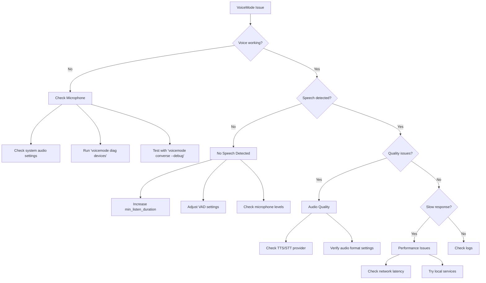

# Troubleshooting Guide

This guide helps you diagnose and resolve common issues with VoiceMode.

## Quick Diagnostic Flowchart



## Most Common Issues

### 1. [No Speech Detected](voice-interaction/no-speech-detected.md)
**Symptoms:** Recording completes but no speech is recognized
**Quick Fix:** `converse("message", min_listen_duration=5.0)`

### 2. API Authentication Failed
**Symptoms:** "Unauthorized" or "Invalid API key" errors
**Quick Fix:** Set `OPENAI_API_KEY` in your MCP configuration

### 3. Microphone Not Found
**Symptoms:** "No audio input device" errors
**Quick Fix:** Run `voicemode diag devices` and check system permissions

### 4. Service Not Available
**Symptoms:** "Failed to connect to TTS/STT service"
**Quick Fix:** Check service status with `voicemode whisper status` or `voicemode kokoro status`

### 5. Poor Audio Quality
**Symptoms:** Garbled or robotic voice output
**Quick Fix:** Verify audio format with `voicemode config get VOICEMODE_TTS_AUDIO_FORMAT`

## Troubleshooting by Category

### Voice Interaction Issues
- **[No Speech Detected](voice-interaction/no-speech-detected.md)** - Recording but no recognition
- **Audio Quality Problems** - Poor TTS/STT quality (coming soon)
- **Response Delays** - Slow processing times (coming soon)

### Setup & Configuration
- **API Authentication** - OpenAI key issues (coming soon)
- **Missing Dependencies** - FFmpeg, Python packages (coming soon)
- **MCP Connection** - Claude Code integration (coming soon)

### Service Issues
- **Provider Selection** - Failover and discovery (coming soon)
- **Whisper Problems** - Local STT service (coming soon)
- **Kokoro Problems** - Local TTS service (coming soon)
- **LiveKit Issues** - Room-based communication (coming soon)

### Audio Device Problems
- **Microphone Access** - Permissions and detection (coming soon)
- **[WSL2 Audio](audio-devices/wsl2-audio.md)** - Windows Subsystem for Linux
- **macOS Permissions** - Privacy settings (coming soon)

## Getting Debug Information

### Enable Debug Logging

```bash
# For detailed debug output
export VOICEMODE_DEBUG=true

# For VAD (Voice Activity Detection) debugging
export VOICEMODE_VAD_DEBUG=true

# Run with debug flags
voicemode converse --debug
```

### Check System Status

```bash
# Show system information
voicemode diag info

# List audio devices
voicemode diag devices

# Check service status
voicemode whisper status
voicemode kokoro status

# View recent logs
voicemode logs --tail 50
```

### Collect Diagnostics for Bug Reports

When reporting issues, include:

1. **System info:** `voicemode diag info`
2. **Debug logs:** Run command with `--debug` flag
3. **Event logs:** `voicemode logs --tail 100`
4. **Configuration:** `voicemode config list`

## Quick Command Reference

| Issue | Command | Purpose |
|-------|---------|---------|
| No audio | `voicemode diag devices` | List available audio devices |
| Test voice | `voicemode converse` | Interactive voice test |
| Service down | `voicemode whisper status` | Check Whisper service |
| API errors | `voicemode config get OPENAI_API_KEY` | Verify API key |
| Debug mode | `export VOICEMODE_DEBUG=true` | Enable detailed logging |

## Getting Help

If you can't resolve your issue:

1. Check the [GitHub Issues](https://github.com/mbailey/voicemode/issues) for similar problems
2. Review the [documentation](https://voicemode.dev)
3. File a new issue with diagnostic information

## Contributing

Found a solution to a problem not documented here? Please contribute:

1. Add your solution to the appropriate troubleshooting document
2. Update this index if adding a new category
3. Submit a pull request

Your contributions help make VoiceMode better for everyone!